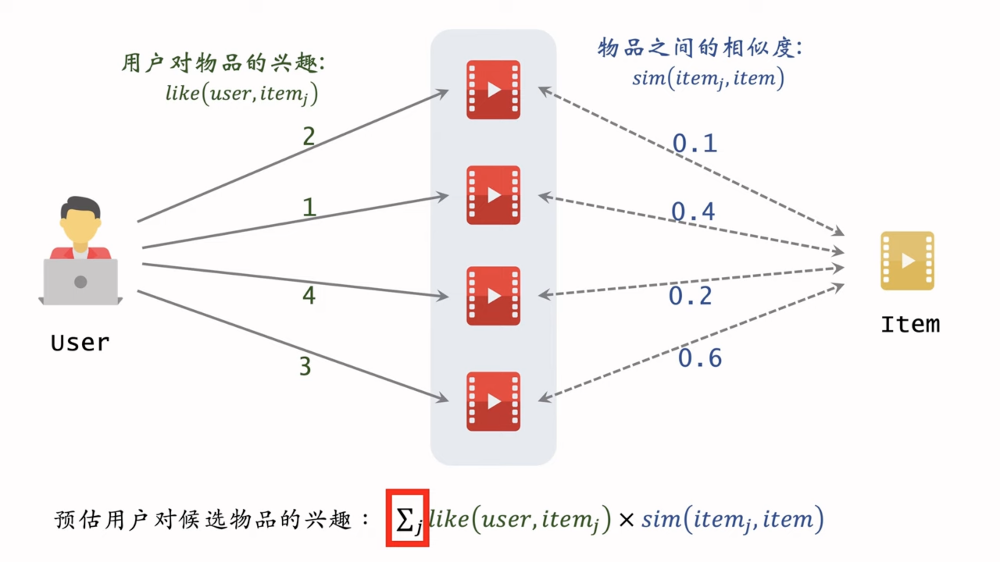
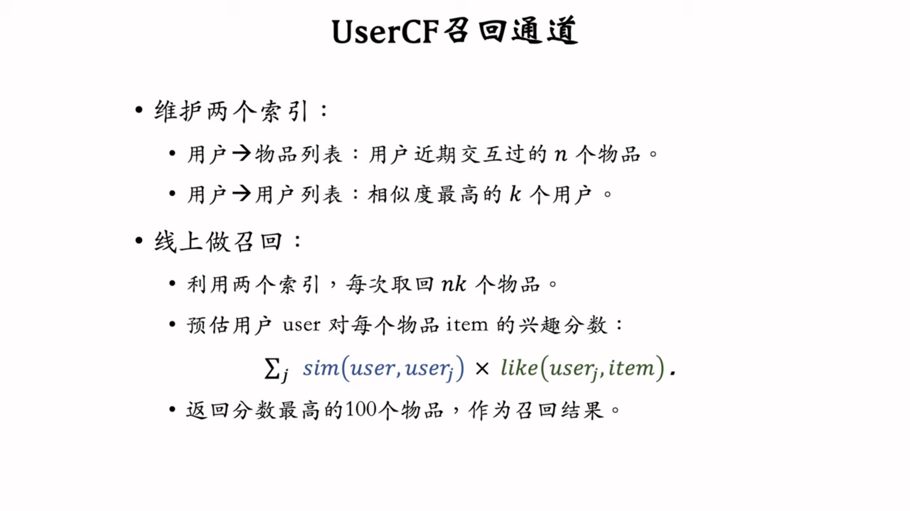
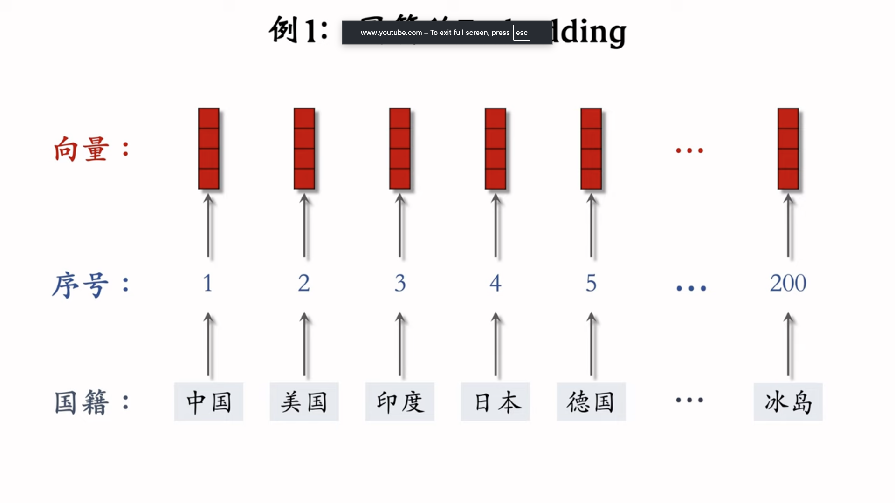
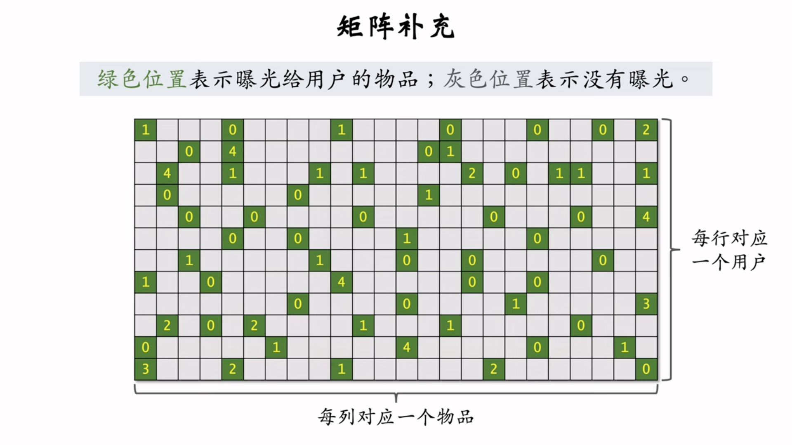

# 2. 召回

Created: March 13, 2026 10:42 PM
Class: 推荐系统

# 1. 基于物品的协同过滤：ItemC

- Collaborative Filtering
- **ItemCF的物品相似度完全基于用户行为数据（用户重合度和评分相似度），不考虑物品本身的内容或属性。**
- 基于用户交互过或者喜欢的item，推荐相似items。
    - 如果用户喜欢物品 $item_1$，而物品 $item_1$和物品 $item_2$ 相似
    - 那么用户很可能喜欢物品 $item_2$



## 物品的相似度

两个物品的受众重合度越高，两个物品越相似。

- 喜欢物品 $i_1$ 的用户记作集合 $W_1$
- 喜欢物品 $i_2$ 的用户记作集合 $W_2$
- 交集： $V=W_1 \cap W_2$
- 两个物品的相似度：

$$
sim(i_1,i_2)=\frac{|V|}{\sqrt{|W_1|\cdot|W_2|}}
$$

- 这个公式没有考虑喜欢的程度： $like(user, item)$

$$
sim(i_1,i_2)=\frac{\sum_{v\in V}like(v,i_1)\cdot like(v,i_2)}{\sqrt{\sum_{u_1\in W_1}like^2(u_1, i_1)}\cdot\sqrt{\sum_{u_2\in W_2}like^2(u_2, i_2)}}
$$

- 其实就是余弦相似度：
    - 把一个物品表示为一个向量
    - 向量的每个元素就是一个用户，值就是用户对物品的喜爱程度

## 召回过程

### 离线计算

- 建立用户 → 物品的索引
    - 记录用户最近点击，交互过的物品ID
    - 给定用户ID，我们可以快速找到他近期感兴趣的物品列表
- 物品 → 物品索引
    - 计算物品之间的两两相似度
    - 对于每个物品，索引它最相似的k个物品
    - 给定物品ID，可以快速找到它最相似的k个物品

### 线上召回

- 给定用户ID，通过用户→物品索引，找到用户近期感兴趣的物品列表（last-n）
- 对于last-n中的每个物品，通过物品→物品的索引，找到top-k相似物品
- 对于召回的物品 $n*k$ 个，进行计算：
    - $\sum_jlike(user,item_j)\times sim(item_j, item)$

# 2. Swing召回通道

给用户设置权重，解决小圈子问题

- 两个人可能在同一个微信群，互相转发了内容，但是其实相关性不高。
- 解决泛用户问题，用户可能点击/浏览了1k个帖子，另一个用户可能点击浏览了900个帖子，可能只是随便刷刷，不代表重叠有共性。

$$
sim(i_1,i_2)=\sum_{u_1\in V}\sum_{u_2\in V}\frac{1}{\alpha+overlap(u_1,u_2)}
$$

# 3. 基于用户的协同过滤：UserCF

- 如果用户 $user_1$ 跟用户 $user_2$ 相似，而且 $user_2$ 喜欢某物品
- 那么用户 $user_1$ 也很可能喜欢该物品

$$
score(user, item) = \sum_j sim(user, user_j)\times like(user_j, item)
$$

- 寻找和用户兴趣非常相似的网友。
    - 如果和我兴趣相似的网友喜欢一篇笔记，但是我没有看过笔记
    - 那么给我推荐这个笔记
- 相似网友：
    - 交互的笔记重合度
    - 关注的作者重合度

### 用户相似度计算

- 用户 $u_1$ 喜欢的物品记作集合 $J_1$
- 用户 $u_2$ 喜欢的物品记作集合 $J_2$
- 定义交集 $I=J_1\cap J_2$
- 两个用户的相似度

$$
sim(u_1,u_2)=\frac{|I|}{\sqrt{|J_1|\cdot |J_2|}} = \frac{\sum_{l\in I}1}{\sqrt{|J_1|\cdot |J_2|}} 
$$

这个公式把热门和冷门笔记同等对待。但是热门物品的话，可能大家都喜欢，所以反应用户独特的兴趣。反而是冷门的物品，更能反应用户的兴趣。

$$
sim(u_1,u_2) = \frac{\sum_{l\in I}\frac{1}{log(1+n_l)}}{\sqrt{|J_1|\cdot |J_2|}} 
$$

- $n_l$ 是喜欢物品 $l$ 的用户数量，反映其热门程度。

### 索引建立

1. 用户 → 物品
    - 记录每个用户最近交互过的物品
2. 用户 → 用户
    - 对于每个用户，索引他最相似的k个用户

### 线上召回

1. 给定用户，通过用户到用户索引，找到最相似的top-k用户
2. 对于top-k用户，通过用户对物品索引，找到用户最近感兴趣的物品列表（last-n）



# 4. 离散特征处理

1. 建立字典，把类别映射成序号
2. 向量话：把序号映射成向量
    - One-hot编码：把序号映射成高维稀疏向量
    - Embedding：把序号映射成低维稠密向量

### One-Hot编码

```jsx
性别：男 -> 1，女 -> 2
One-Hot Embedding: 用一个二位向量表示
- 未知性别：0 -> [0,0]
- 男性:    1 -> [1,0]
- 女性:    2 -> [0,1]
```

One-Hot编码根据类别种类的数量建立稀疏向量。

- 对于自然语言中的单词，或者物品ID，有几亿个类别，不适合用One-Hot编码。

### Embedding嵌入



- 参数数量：
    - 国籍数量：200
    - 向量维度：1x4
    - 参数数量：4x200 = 800
    
    $$
    参数数量=向量维度\times类别数量
    $$
    
    - Embedding层的input是序号，输出是向量

## 矩阵补充

- 将物品ID和用户ID通过Embedding层映射成向量
- 通过向量内积确定相似度

### 数据集

（用户ID，物品ID，兴趣分数）：$\Omega=\{(u,i,y)\}$ 

- 兴趣分数是系统记录的：
    - 曝光但是没有点击：0分
    - 点击，点赞，收藏，转发 → 各算一分
    - 分数范围： [0, 4]
- 把用户u映射成embedding $a_u$
- 把物品i映射成embedding $b_i$
- 优化：

$$
\min_{A,B} \sum_{(u,i,y)\in \Omega} (y - \langle a_u, b_i \rangle)^2
$$



- 实际效果不好
    - 只用了ID embedding，而没有利用物品，用户属性
    - 物品属性：类别，关键词，地理位置，作者信息
    - 用户模型：性别，年龄，地理位置，感兴趣的类目
- 负样本选取方式不对
    - 正样本：曝光之后，有点击有交互的（correct）
    - 负样本：曝光之后，没有点击（交互）（wrong）
- 训练方法不好
    - 向量内积，不如余弦相似度。
    - 用Regression来拟合，不如交叉熵。