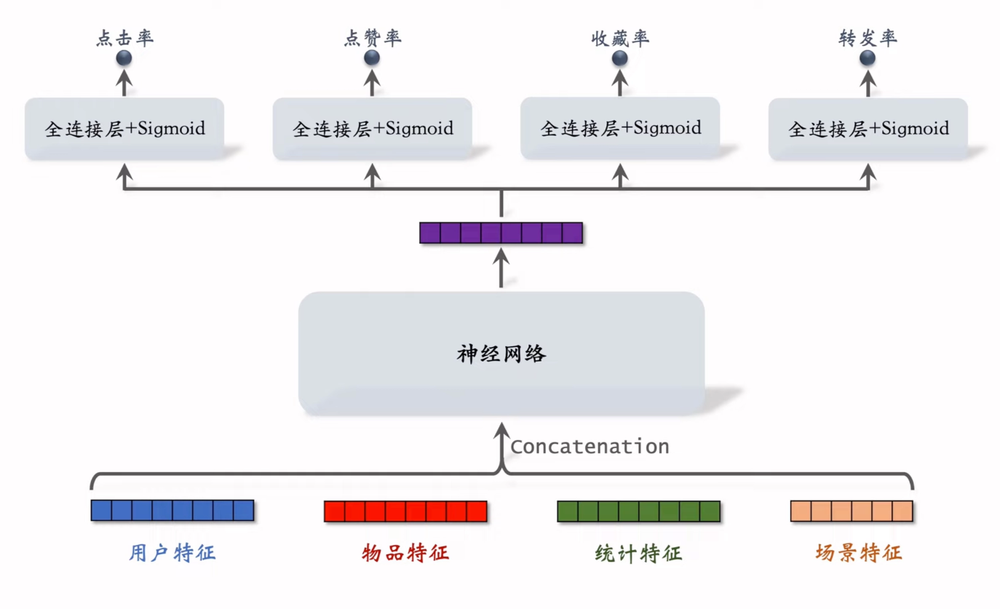
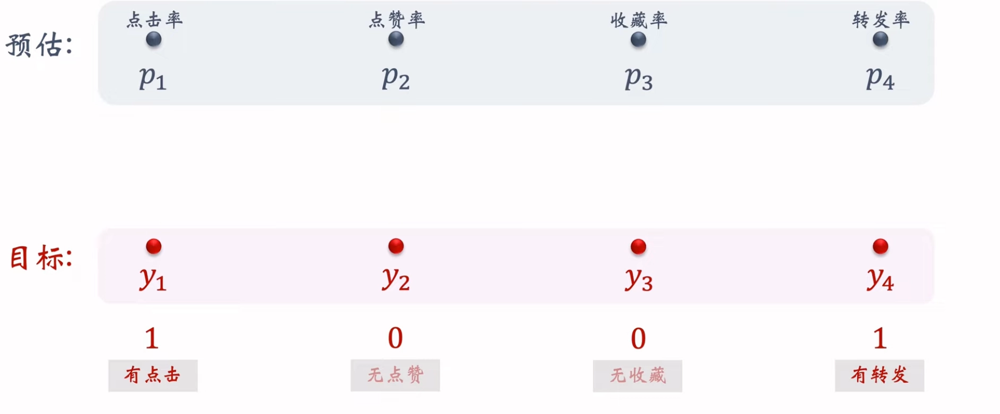
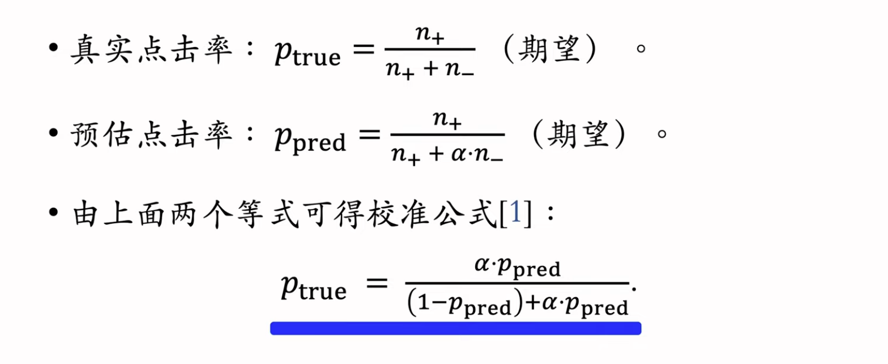
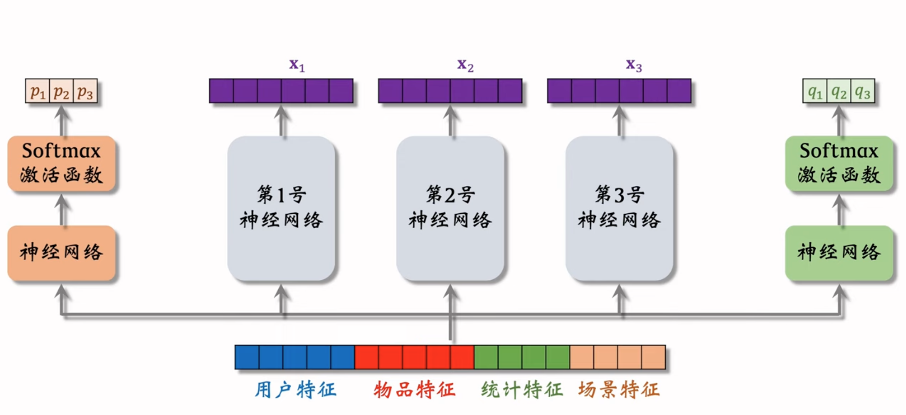
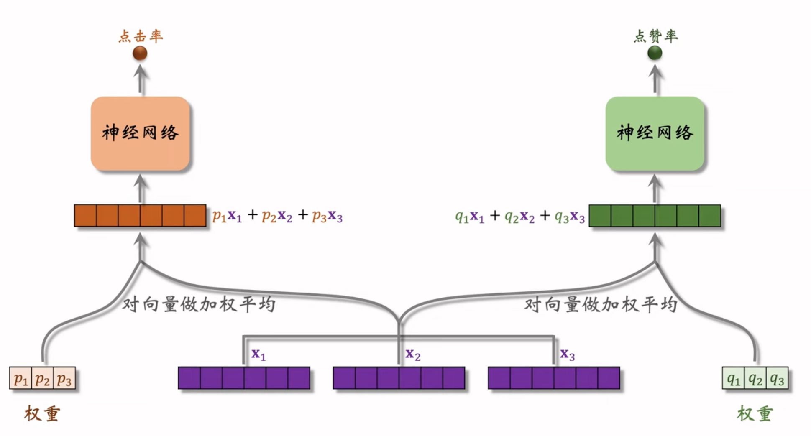
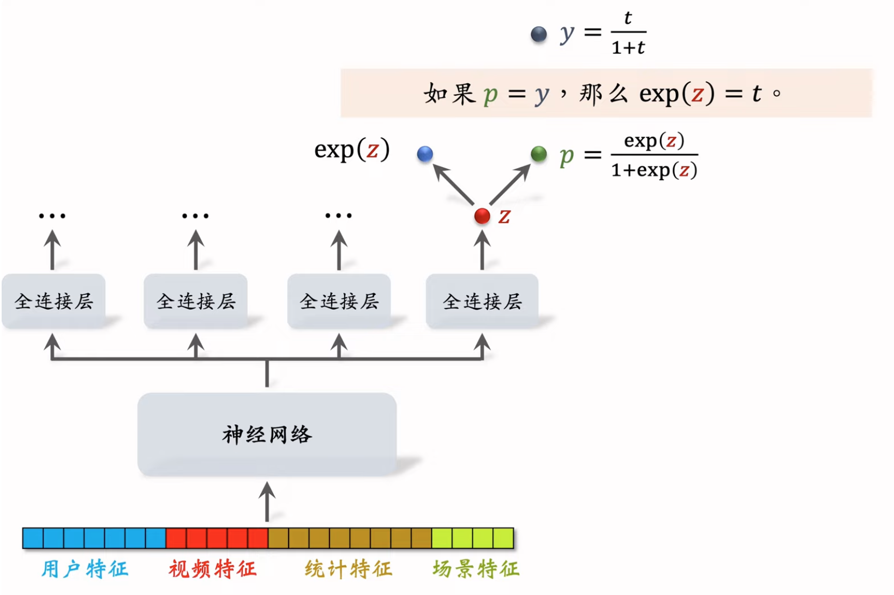
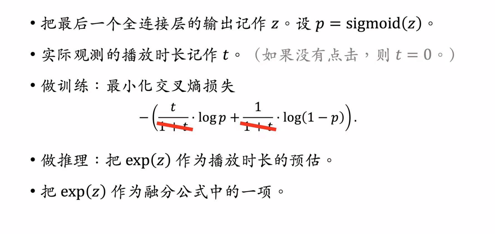

# 3. 排序

Created: March 17, 2026 10:36 AM
Class: 推荐系统

# 1. 多目标模型

用户-笔记交互

对于每个笔记：

- 曝光次数
- 点击次数
- 点赞次数
- 收藏次数
- 转发次数

计算点击率，点赞率，收藏率，转发率等多种分数，融合（最简单的办法是加权平均），根据融合的分数做排序，截断。

## 输入：

- 用户特征
- 物品特征
- 统计特征：
    - 用户在过去30天中，曝光了多少笔记，点赞了多少笔记
    - 物品在过去30天中，被曝光了多少次，浏览量等
- 场景特征
    - 动态，随着用户的请求传过来的
    - 请求的时间，地点等

把这些特征拼接起来，传进神经网络，输出一个向量，这个向量再作为input送进四个不同的神经网络（全连接层+Sigmoid）

## 训练

- 二分类：是否点击、点赞、收藏、转发
- 通过交叉熵函数作为Loss

$$
\text{CrossEntropy}(y_1,p_1)=-(y_1\cdot\text{ln}p_1+(1-y_1)\cdot\text{ln}(1-p_1))
$$

- 总训练的损失函数：

$$
\sum_{i=1}^4\alpha_i\cdot\text{CrossEntropy}(y_i,p_i)
$$

- 训练问题：
    - 类比不平衡
    - 每100次曝光，10次点击，90次无点击
    - 每100次点击，10次收藏，90次无收藏
- 解决方案：
    - 负样本降采样（down-sampling）
    - 让正负样本数量平衡，节约计算
- 预估值校准：
    - 降采样负样本（未点击）之后，预估的点击率会大于真实的点击率
        
        
        

# 2. Multi-gate Mixture-of-Experts （MMoE）

1. 训练多个Experts（架构一样）

1. 业务指标的预测是Experts输出向量的加权平均，权重是由一个Gate Network，网关神经网络决定的

### 问题：极化（Polarization）

- softmax激活函数输出的向量中，一个值接近1，其他为0
- 训练时，对softmax的输出使用dropout：
    - softmax输出的n个数值被mask的概率都是10%
    - 也就是每个专家都有10%的概率被丢弃

# 3. 预估分数的融合

1. 简单的加权平均

$$
p_{click}+w_1\cdot p_{like}+w_2\cdot p_{collect} +...
$$

1. 点击率乘其他项的加权和

$$
p_{click}\cdot (1+w_1\cdot p_{like}+w_2\cdotp_{collect}+...)
$$

1. 短视频融分公式

$$
(1+w_1\cdot p_{time})^{\alpha_1}\cdot (1+w_2\cdot p_{like})^{\alpha_2}\cdot ...
$$

1. 快手
    - 首先拿出来一个分数 $p_{time}$，对n个候选进行排名
    - 如果某个视频的排名是 $r_{time}$，则他的得分是 $\frac{1}{r_{time}^\alpha+\beta}$
    - 对其他分数依次这样处理，最后的融合分数是

$$
\frac{1}{r_{time}^{\alpha_1}+\beta_1}+\frac{1}{r_{click}^{\alpha_2}+\beta_2}+\frac{1}{r_{like}^{\alpha_3}+\beta_3}+...
$$

1. 电商
    - 曝光 → 点击 → 加购物车 → 付款
    - 模型预测点击，加购物车，支付的概率
    
    $$
    p_{click}^{\alpha_1} \times p_{cart}^{\alpha_2} \times p_{pay}^{\alpha_3} \times 
    price^{\alpha_4}
    $$
    

# 4. 视频播放建模

## 播放时长

- 直接用Regression来预测播放时长效果不好
- 解决方案：
    - p和y做交叉熵运算
    
    
    

## 完播率

### 回归：Regression

完播率 → 通过视频播放了多久来判断

- 视频10min，播放了4分钟，那么y等于0.4
- y的取值范围是0-1
- 那么可以用交叉熵来优化

$$
\text{loss}=y\cdot \log p + (1-y)\cdot \log(1-p)
$$

### 二分类

- 完播指标：播放超过80%就是完播
- 0，1分类

不能直接把完播率直接放进融分公式，因为短视频的完播率明显比长视频高

$p_{finish}=\frac{\text{预估完播率}}{f(\text{播放时长}）}$

# 5. 排序模型特征

## 用户画像

1. 用户ID（在召回，排序中做embedding）
2. 人口统计学属性：性别，年龄
3. 账号信息：新老，活跃度
4. 感兴趣的类目，关键词，品牌

## 物品画像

1. 物品ID
2. 发布时间
3. GeoHash、所在城市
4. 标题、类目、关键词、品牌
5. 字数，图片数，视频清晰度、标签数
6. 内容信息量，图片美学

### 用户统计特征

- 用户最近三十天的曝光数，点击数，点赞数，收藏数
- 按照笔记分桶：图文 & 视频
    - 分别统计，看用户偏好
- 按笔记类目分桶：
    - 美食，美妆，科技数码

### 笔记统计特征

- 笔记的最近三十天曝光、点击、点赞等
- 按照笔记用户/观众的性别、年龄分桶
- 作者特征：发布的笔记数，粉丝数，消费指标等

### 场景特征

- 用户定位：GeoHash，城市
- 当前时刻
- 是否为节假日、周末
- 手机品牌、型号、操作系统

## Data Processing

离散特征：

- 用户、物品、作者ID
- 类目，关键词，城市，手机品牌
- 做embedding

连续特征：

- 分桶，变成离散特征
- 年龄，笔记字数，视频长度等
- 其他变换：
    - 长尾特征：
        - 一个笔记的曝光率一般是几百，但是热门帖子能达到几百万
        - 用对数函数来进行平滑调整
        
        $$
        \log (1+x)
        $$