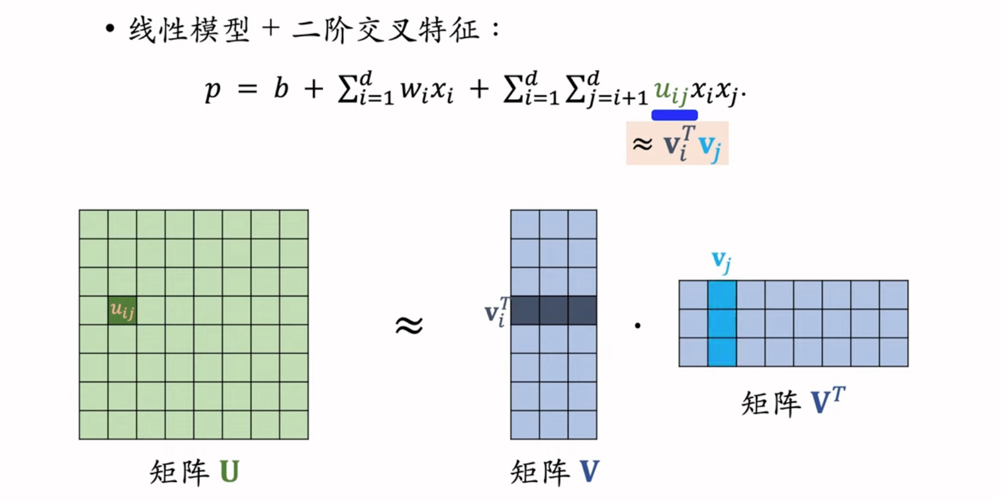
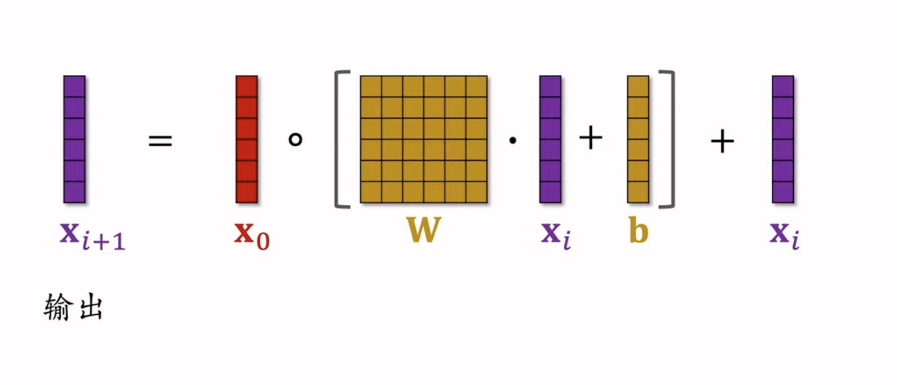
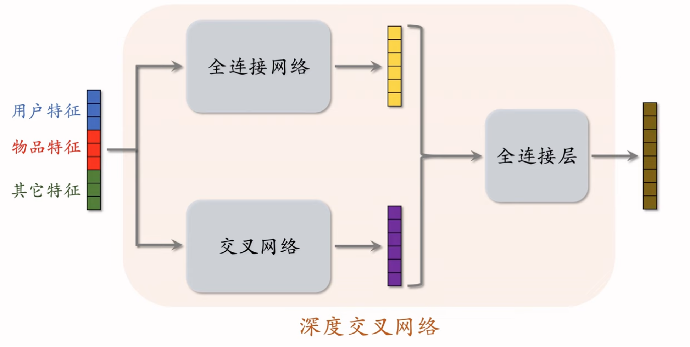
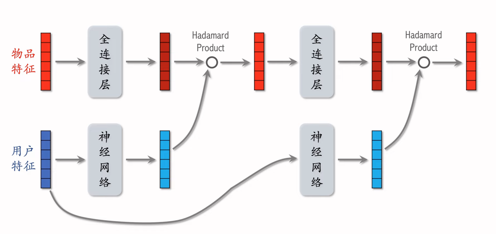
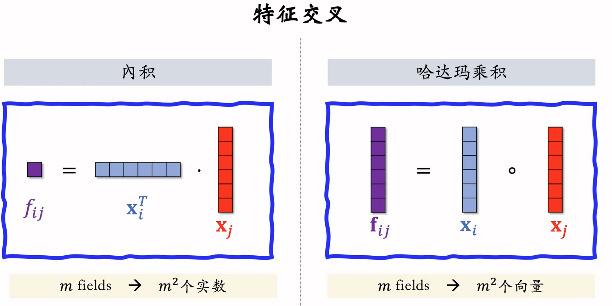
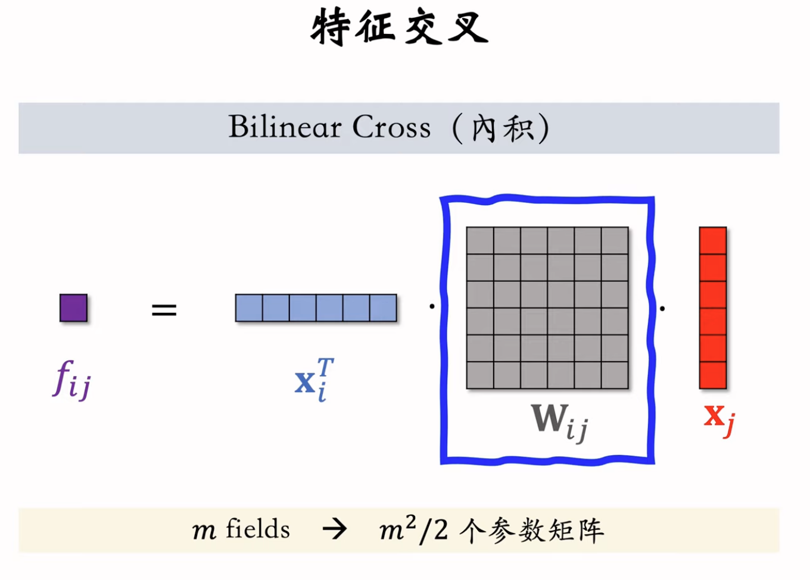
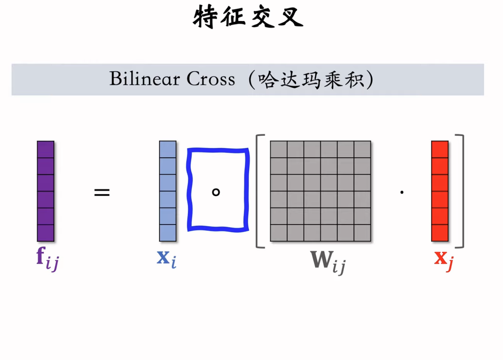
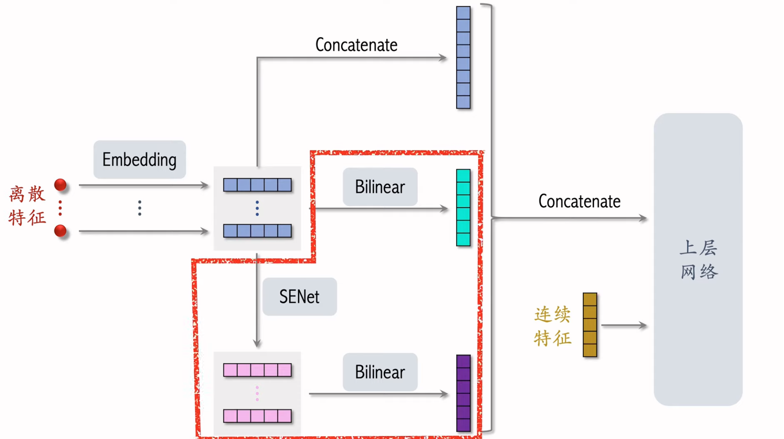

# 3. 特征交叉

Created: March 17, 2026 1:26 PM
Class: 推荐系统

# 因式分解机：Factorized Machine

## 线性模型

- 对于 $d$ 个特征，记作 $x = [x_1,...,x_d]$
- 线性模型：

$$
p=b+\sum_{i=1}^dw_ix_i
$$

- 模型有 $d+1$ 个参数
- 预测结果是特征的加权和。

## 二阶交叉特征

$$
p=b+\sum_{i=1}^dw_ix_i+\sum_{i=1}^d\sum_{j=i+1}^du_{ij}x_ix_j
$$

- 参数数量过大 → $O(n^2)$
- 低秩矩阵拟合 → $O(kd)$
    
    
    

# DCN: Deep & Cross Network（深度交叉网络）

### 交叉层：Cross Layer

- $x_0$：第0层的元素（原始特征）
- $x_i$：第i层的元素（i个全连接层之后的向量）
- $x_i$ 通过全连接层得到  y，然后 y 和 $x_0$ 的 Hadamard product（逐元素相乘）得到 $z$，然后和 $x_i$ 相加，得到 $x_{i+1}$

### DCN：深度交叉网络

# LHUC（PPNet）

- Learning Hidden Unit Contribution（LHUC）
- 快手用于精排，并称之为PPNet
- 用户特征中的神经网络，是多个全连接层，激活函数是Sigmoid乘2，来放大特征，提高个性化

# SENet

- 假设我们有 $m$ 个特征，每个特征是一个 $k$ 维向量 → $m\times k$ 的特征矩阵
- Average Pooling，得到一个 $m\times1$的向量
- 用 FC 和 ReLU，降维到 $\frac{m}{r} \times 1$，然后用 FC 和 Sigmoid 升维到 $m\times1$
- 然后和原始矩阵 row-wise multiply，逐行相乘

**本质：**

SENet对离散特征进行 field-wise 加权。

## 特征交叉

- 每个特征的embedding维度需要一样。

### Bilinear Cross 内积

### Bilinear Cross 哈达玛乘积

