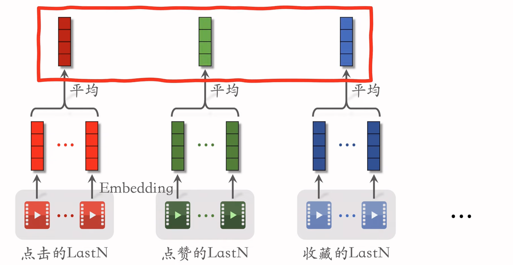
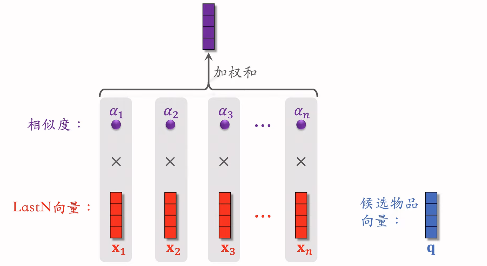

# 4. 用户行为序列建模

Created: March 17, 2026 3:28 PM

## LastN

- LastN，就是用户最近交互（点赞，收藏）的 n 个物品的 ID
- 把这 n 个物品的 ID 做 embedding，得到 n 个向量
- 把 n 个向量取平均，代表用户过去对什么东西感兴趣
    - 更好的做法是 attention，但是计算量更大
- 适用于召回的双塔模型，粗排的三塔模型，精排模型

# DIN：Deep Interest Network

- 用加权平均代替平均
- 权重通过注意力（attention）机制来进行确定
    - 候选物品和用户LastN物品的相似度
- Attention需要 LastN 和候选物品，所以只适合精排
- 简单平均的话只需要 LastN，这是用户自身的特征，适用于双塔模型和三塔模型。
- N只能记住过去几百个交互，关注短期兴趣，遗忘长期兴趣。

# SIM模型

- 保留用户的长期行为序列（n很大），但是计算量不会过大。
- 对于每个候选物品，在用户的 LastN 里面快速查找，找到最相关的 k 个物品。
- 把 LastN 变成 TopK，然后输入到注意力层。

## 查找：

1. Hard Search：
    - 根据候选物品的类目做查找，保留LastN物品中类目相同的。
    - 简单，快速，无训练。
2. Soft Search：
    - 把物品做成embedding
    - 把候选物品的向量作为query，k近邻查找，保留 LastN 物品中最接近的 k 个。

## 注意力机制：

- 和 DIN 的注意力机制相同。
- 使用时间信息：
    - 用户和某个 LastN 物品交互的时刻距今为 $\delta$
    - 对 $\delta$ 做离散化，再做 embedding，变成向量 d
    - 把两个向量做 concatenation，表征一个 LastN 物品
        - 向量 $x$ 是物品的 embedding
        - 向量 $d$ 是时间的embedding
- DIN不需要考虑时间，因为DIN的序列比较短，是用户的近期行为。
- SIM的序列长，记录用户的长期行为，时间越久远，重要性应该越低。