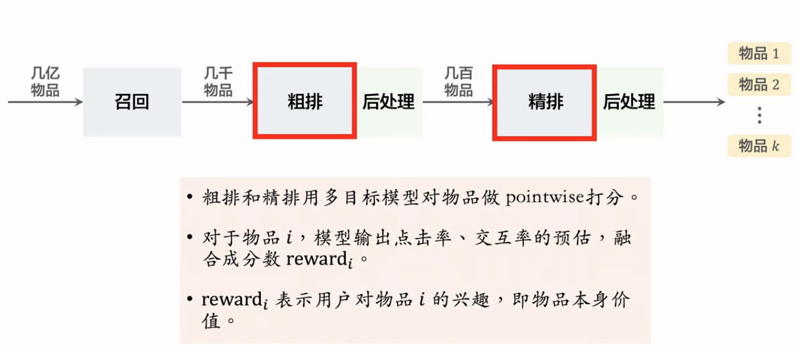
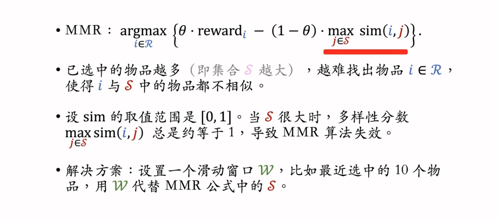
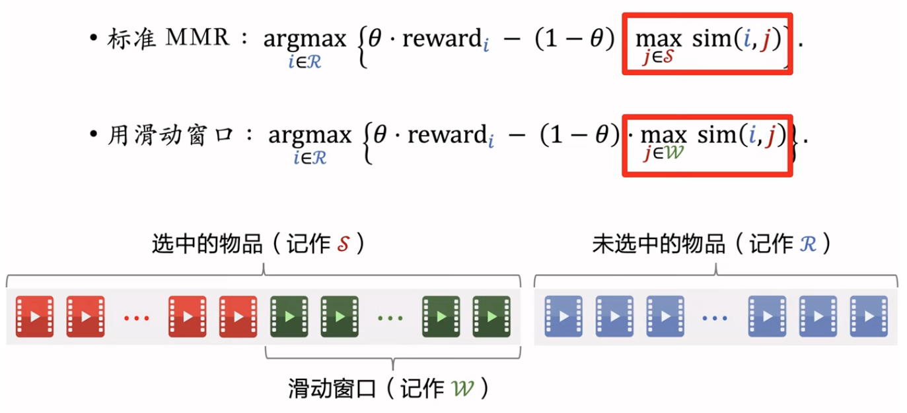
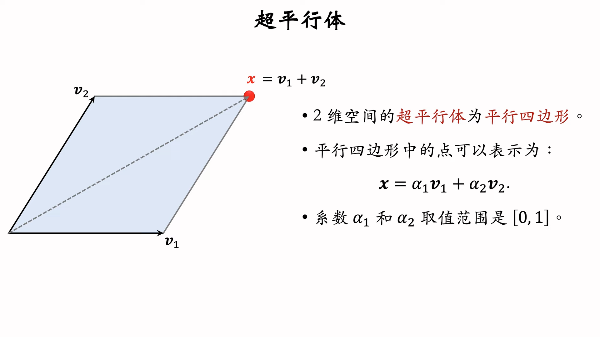
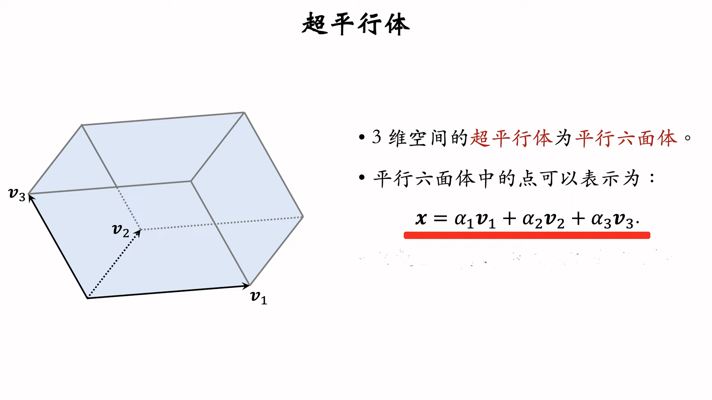
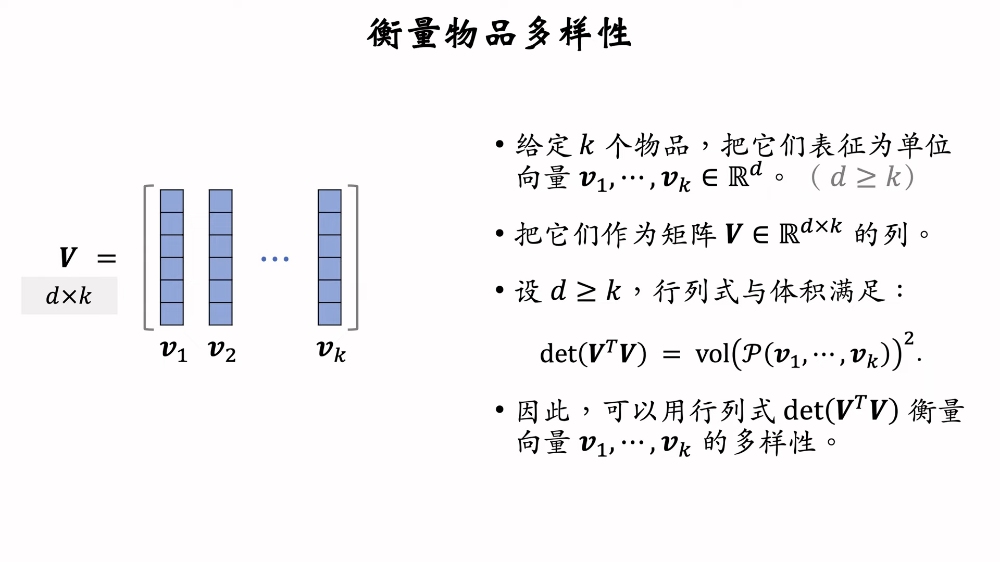
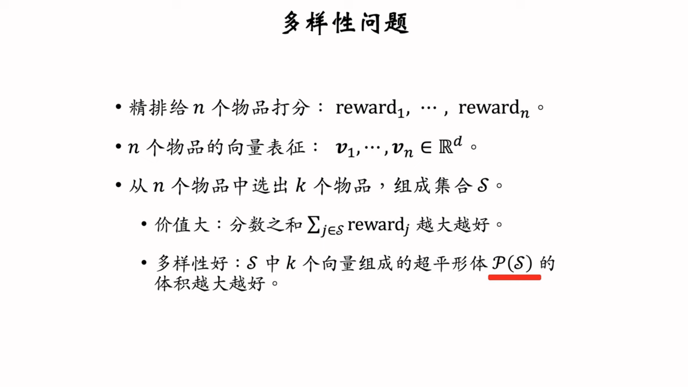
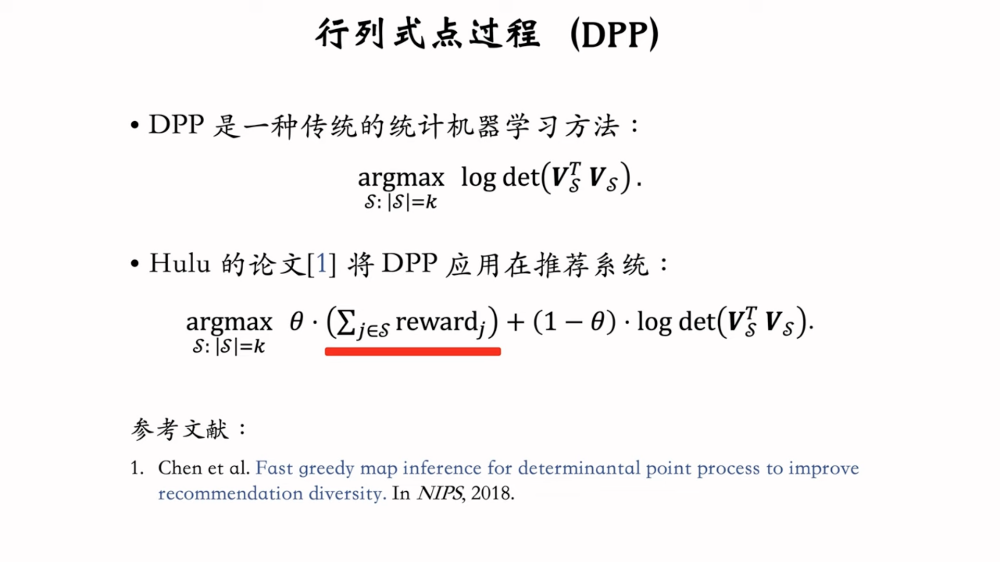

# 5. 重排

## 1. 物品相似度

### 基于物品的属性标签

- 类目，品牌，关键词
- 根据一级类目、二级类目、品牌计算相似度

### 基于物品的向量表征

1. 召回阶段双塔模型的物品塔中的物品表征
    - 效果一般
    - 头部现象：曝光和点击集中在少数物品，长尾物品和新物品上表现差
2. 基于图文内容的物品表征
    - CV、NLP
    - 用CNN提取图像特征，用BERT提取文本特征
    - CLIP来进行图片和文本的embedding space对齐
        - 对于图片-文本二元组，预测图文是否匹配。

## 2. 提高多样性的方法

- 后处理是为了提高多样性：
    - 从n个候选中，选出k个，既保证他们的总分高，也需要他们的多样性。
    - 后处理也被称为重排

### MMR：Maximal Marginal Relevance

- 精排给n个物品打分，融合分数为 $reward_i,...,reward_n$
- 把第i个物品和第j个物品的相似度记作 $sim(i,j)$
- 从n个候选中选出k个，既要保证高精排分数，又要保证多样性。
- 被选中物品：S
- 未被选中物品：R
- 计算集合R中每个物品 i 的 Marginal Relevance

$$
MR_i=\theta\cdot reward_i -(1-\theta)\cdot \max_{j\in S}sim(i,j)
$$

$$
\argmax_{i\in R} \text{MR}_i
$$

### 滑动窗口

## 3. 重排推荐

1. 最多连续出现 k 篇某种笔记
2. 每 k 篇笔记最多出现 1 篇某种笔记（运营、广告）
3. 前 t 篇笔记最多出现 k 篇笔记

## 4. DPP

### 数学基础

### DPP：行列式点过程

