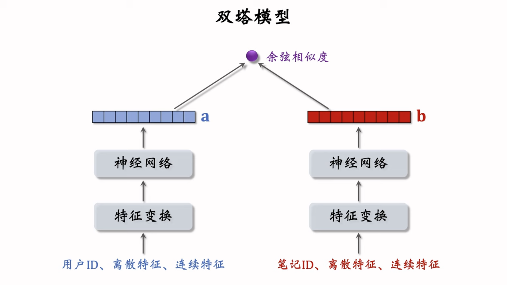
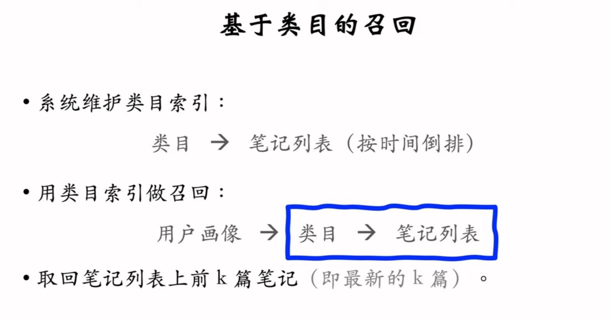
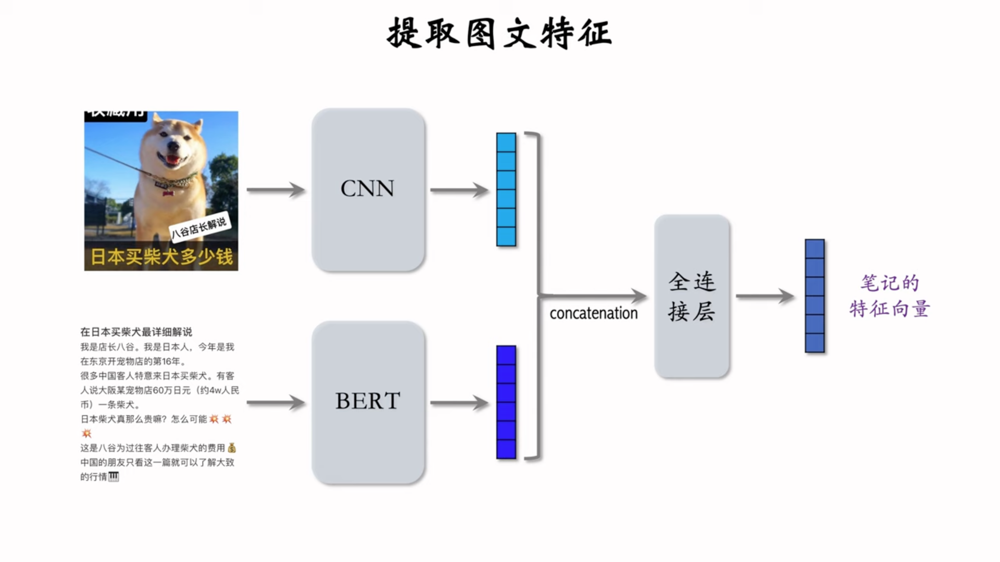
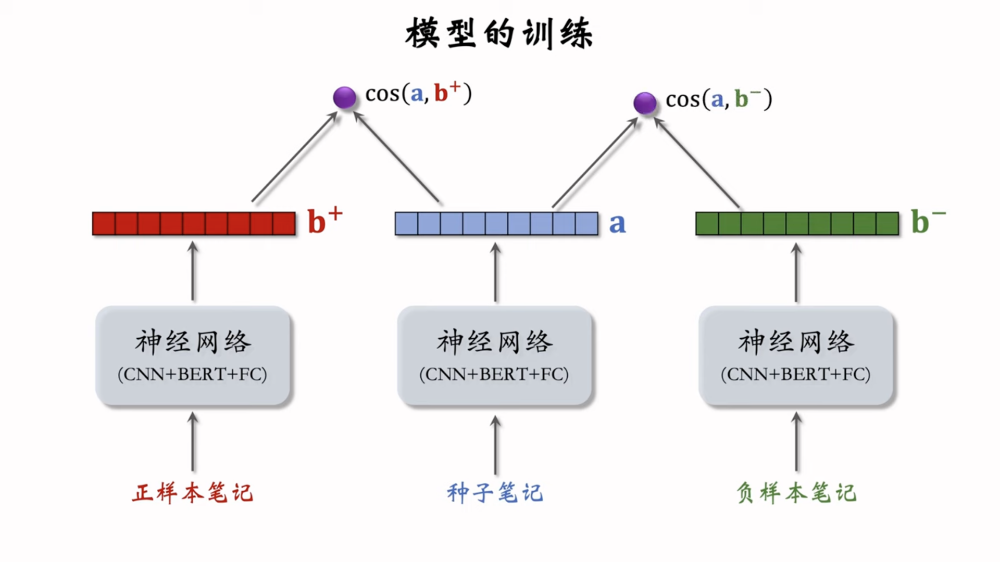
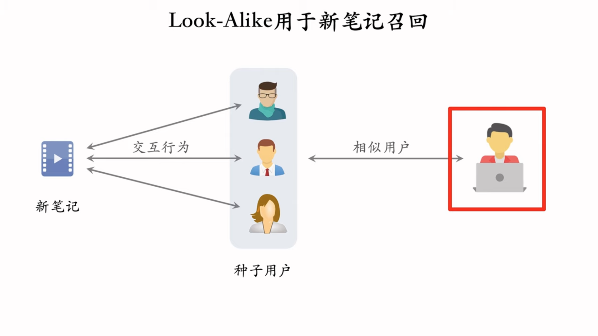

# 6. 冷启动

# UGC冷启动：User-Generated-Content

- 小红书上用户新发布的笔记
- B站上用户新上传的视频
- 今日头条上作者新发布的文章

新笔记刚刚发布，缺少和用户的交互，导致推荐的难度大、效果差。

- 需要扶持新发布、低曝光的文章，来增长作者发布意愿。

### 目标

1. 精准推荐：把新笔记推荐给合适的用户，不引起用户的反感。
2. 激励发布：流量向低曝光新笔记倾斜，激励作者发布。
3. 挖掘高潜：通过初期的小流量的试探，找到高质量的笔记，给予流量倾斜。

### 评价指标

1. 作者侧指标
    1. 发布渗透率：penetration rate

        $\frac{\text{当日发布人数}}{\text{日活人数}}$

    2. 人均发布量

        $\frac{当日发布笔记数}{日活人数}$

2. 用户侧指标
    1. 新笔记指标：新笔记的点击率、交互率
    2. 大盘指标：消费市场，日常、月活
        - 如果大力扶持低曝光新笔记，作者侧指标会变好，但是用户侧大盘消费指标变差。
3. 内容侧指标：
    1. 高热笔记占比

## 物品冷启动：简单的召回通道

笔记：

- 自带图片、文字、信息
- 算法或人工标注的标签
- 没有用户点击、点赞
    - 没法用 ItemCF
        - ItemCF是通过物品受众的相似度/重合度来进行计算的。
- 没有笔记ID Embedding

### 双塔模型：冷启动改进

- 一开始笔记ID学的不好，因为没有用户的交互。
- 物品塔做 ID embedding的时候，可以让所有的新笔记共享一个ID，而不是用自己真正的ID。
    - Default embedding。
- 利用相似笔记 embedding 向量
    - 查找 Top-K 内容最相似的高曝光笔记，取平均。
- 多个召回池：1小时新笔记，6小时新笔记，24小时新笔记，30天新笔记。

### 类目召回通道

**用户画像：**

1. 感兴趣的类目：美食、科技数码、电影
2. 感兴趣的关键词：大模型，布偶猫

- 只适用于新笔记，但是新笔记在发布几小时后，就没法被召回了
- 弱个性化，不够准确

## 聚类召回

如果物品喜欢一个笔记，那么他会喜欢内容相似的笔记。

- 训练一个神经网络，基于笔记的类目和图文内容，把笔记映射到向量。
- 对笔记向量做聚类，划分为1000个cluster，记录每个cluster的中心方向。
    - k-means，余弦相似度。
1. 当发布新笔记的时候，用神经网络映射到一个特征向量
2. 从1000个cluster的centroid向量中寻找最相似的向量，作为新物品的cluster
3. 索引：cluster → 笔记ID列表（按时间倒排）

### 线上召回：

- 给定用户ID，找到他的 last-n 交互的笔记列表，作为种子笔记。
- 把每个种子笔记映射到向量，寻找最相似的cluster。
- 从每个cluster的索引笔记列表中，取回最新的 m 篇笔记。
    - 取回最多 $mn$ 篇笔记。

### 内容相似度模型：

图文笔记：

- CNN提取图片特征
- BERT提取文本特征
- 拼接，送进MLP，输出笔记的特征向量

    

模型的训练：

## Look-alike

